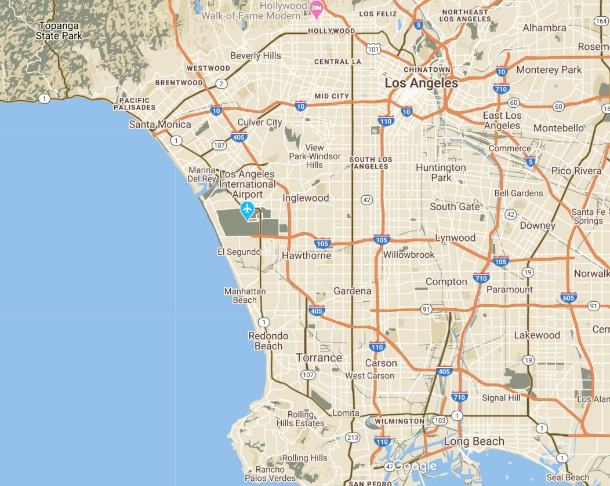
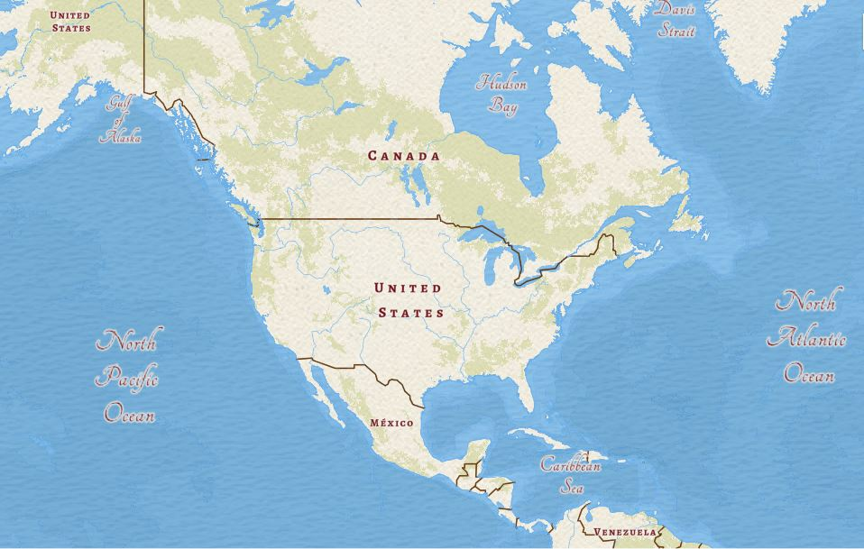
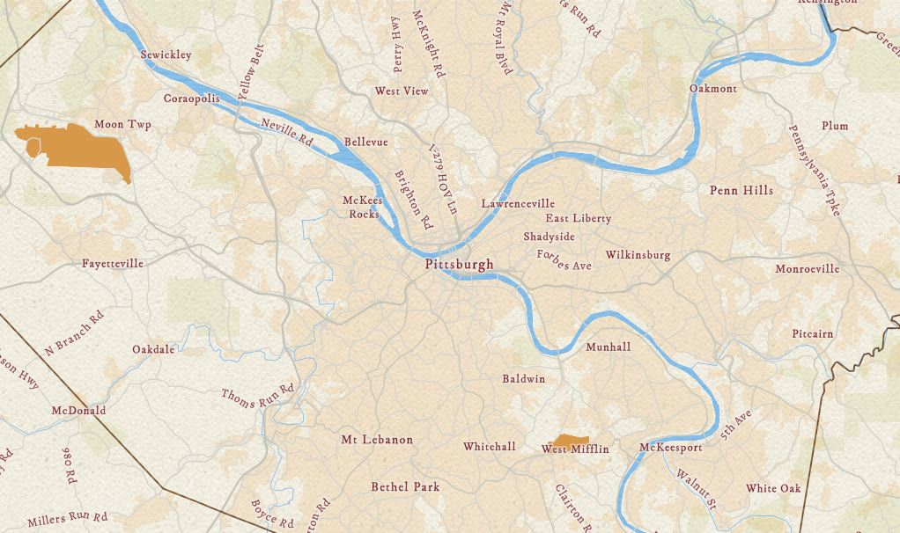
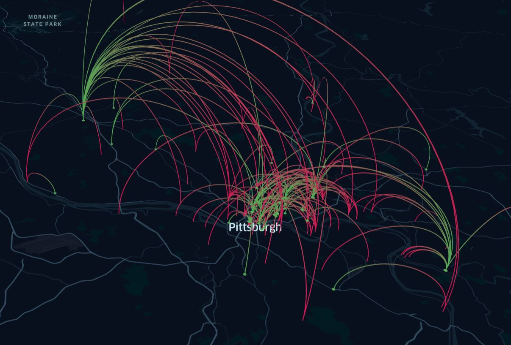
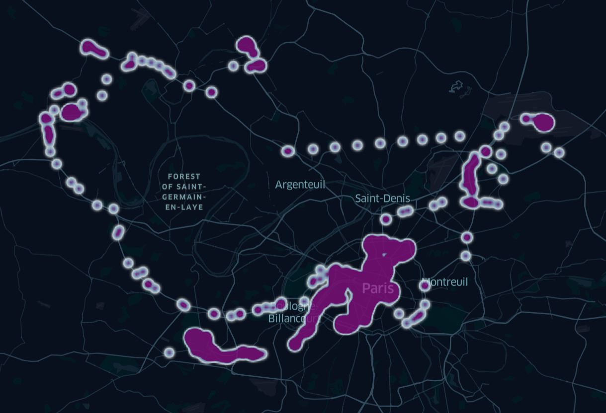

# Karin Gandler - Portfolio
Karin's Gandler Advanced GIS portfolio. 

# About me

Hello! My name is Karin, and I'm a second-year MSPPM student. I'm really excited for this class! I was doing a lot of GIS last semester between the intro class and my Systems project, and I've hardly done any this semester. I'm really happy to be able to do some more GIS.

I'm also very excited to be graduating! I'm sad about the cancellation of Commencement, but I know it's for the best. I'm really passionate about affordable housing and urban economies, so I'm hoping to get a job in local government. I have a background in history and if social distancing lasts long enough I'm going to start doing some history-related GIS projects - anybody have any ideas?

# What I hope to learn

I'm hoping to expand my GIS horizons and broaden my skills, both with ArcGIS and with other mapping tools. As much as I'd like to become a GIS expert, I realize that I probably won't be able to do that in 7 weeks,  but I'm hoping that this class pushes me a few steps closer towards that. I'm really excited to learn new ways to use GIS tools and to learn how to create different sorts of products using GIS. 

# Portfolio

Here are some fun maps I created for the Advanced GIS class!

### Custom Google Maps Style

Here is the custom Google Maps style I created for the very first lab! I was really happy with how this turned out. I used a picture of the Grand Canyon to get my color scheme, and the map really came out looking like a map of a national park, even though the image is of Los Angeles. Before this lab, I didn;t know that you could change the colors of Google Maps, so I had fun messing around with the styler creator tool. 

### Custom ArcGIS Style

Here is my custom ArcGIS style that I created. I used a different picture to create this. The picture was of an old Union Pacific Rail train car that I came across while traveling through Colorado. I found that I liked using this tool better than the custom Google Maps style creator. I just found it easier to use with my PC, and overall thought the controls were more intuitive. The map looked so old-timey, as if it was a map from the Renaissance era! 

Here is a second map from that lab, zoomed into Pittsburgh. 

### Kepler Lab Results

I had a lot of fun with the Kepler lab. First of all, I love the name of the tool. Johannes Kepler was a German astronomer who was a key figure during the Scientific Revolution in the 17th century, best known for discovering the laws of planetary motion. And although that sounds interesting enough, his life is actually far more fascinating than that. Unlike Galilieo, Kepler did not denounce religion; in fact, he incorporated his beliefs into his work, and his scientific inquiry was motivated by his belief that God had created the universe in order for it to be studied and for the secrets of the divine to be revealed through science. These beliefs often got him into trouble: being a scientist in Germany during the Reformation was incredibly difficult, and he and his family were caught up and displaced by the Thirty Years War.

But anyway, here were my results from the Kepler lab! This tool was pretty easy to use, and I hadn't ever seen something mapped with these arcs from point to point before. I thought it was really unique! 

I had seen the heat map function before (it's something I can get done in ArcGIS Pro), but I still liked the result I got in Kepler, and admittedly it was much easier to generate the heat map in Kepler than in ArcGIS Pro, where you have to go through numerous steps to generate something similar. 

### Final Project - The Effect of COVID-19 on Immigrant Populations

Will add tomorrow when final project is fully complete!
